```{r include=FALSE}
setwd("C:/HY/Projects/Wikipath/DVDC_Presentation")
library(knitr)
```

## Intro to Concept
"`Wikipath`" is defined with a deceptively simple goal in mind: Find _any_ shortest path linkage between two articles on the English Wikipedia.

It is an augmented implementation of <a href="https://en.wikipedia.org/wiki/Breadth-first_search">Breadth-First Search (BFS)</a>.

## Example Query
<a href="https://en.wikipedia.org/wiki/Court_House,_Arlington,_Virginia">Court House, Arlington, Virginia</a> $\to$ <a href="https://en.wikipedia.org/wiki/Judiciary_Square_station">Judiciary Square station</a>

```{r echo=FALSE, fig.align='center', out.width='50%'}
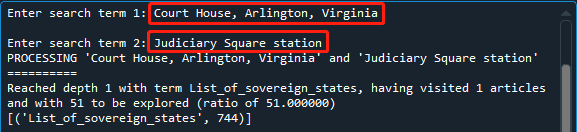
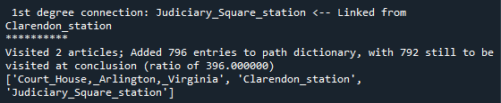
```

## Linkage in action
Notice the link to the target (destination) is only present within a transcluded `Template`.
```{r echo=FALSE, fig.align='center', out.width='75%'}
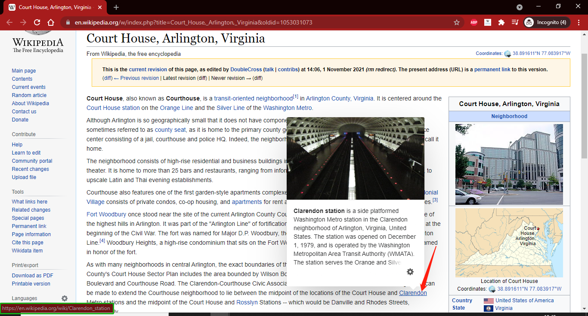

```

## Some analytics terms, defined
- **Number of links added**: The number of unique links newly added when visiting an article, approximately $|\text{links added}| = |\text{unique links on article}| - |Q| - |V|$, where $Q:=\{\text{links already in Queue}\}$ and $V:=\{\text{links already Visited}\}$
- **Ratio of links added**, building on the prior term: $\frac{|\text{links added}|}{|\text{unique links on article}|}$
- **Rolling $X$**: the summary statistic of the last $X$ entries in a series

## Initial plotting
Query: <a href="https://en.wikipedia.org/wiki/Zhongguancun">Zhongguancun</a> to <a href="https://en.wikipedia.org/wiki/Chelsea,_Manhattan">Chelsea, Manhattan</a>

OK to only fixate on line styles at relatively few articles...
```{r echo=FALSE, fig.align='center', out.width='50%'}
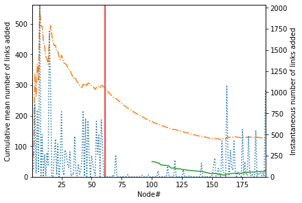
```

...not so great beyond a thousand articles or so.
```{r echo=FALSE, fig.align='center', out.width='50%'}
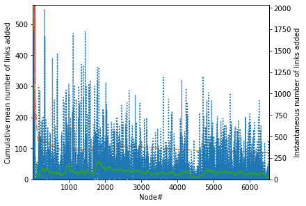
```

## How do we fix the transparency...?
of the instantaneous series and stop it from crowding out the other two series?
```
line_instant = ax2.plot(x, instant, color='tab:blue', linestyle='dotted',
                        alpha=0.25, label='Instantaneous added')
```

Note the `alpha` and `linestyle` parameters.

Better now:
```{r echo=FALSE, fig.align='center', out.width='50%'}
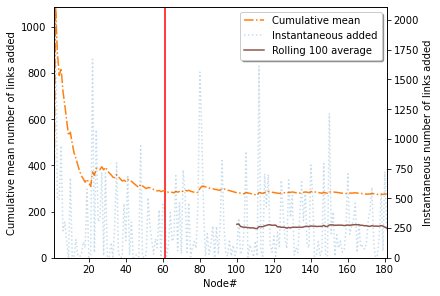
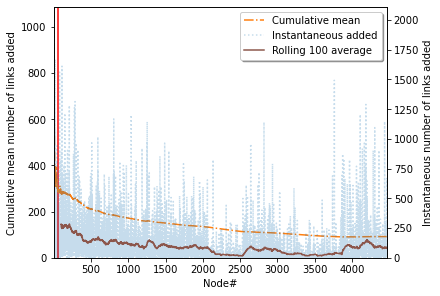
```

## Mind the asymptote!
Query: <a href="https://en.wikipedia.org/wiki/Index_of_Singapore-related_articles">Index of Singapore-related articles</a> to <a href="https://en.wikipedia.org/wiki/Orellana_Province">Orellana Province</a>

Cumulative mean series still discernible early on...
```{r echo=FALSE, fig.align='center', out.width='50%'}
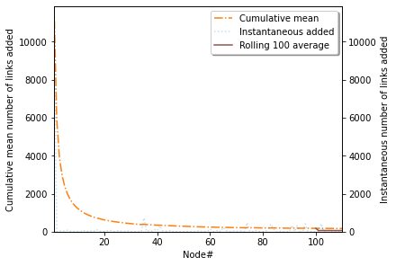
```

But bunched up all together when completing the run!
```{r echo=FALSE, fig.align='center', out.width='50%'}
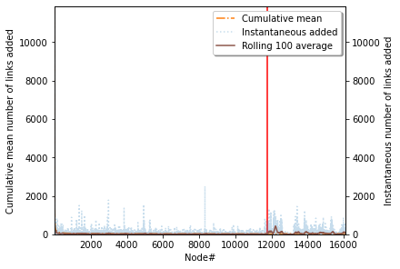
```

## Conditional log-scale
The basic command is:
```
ax.set_yscale('log')
```

The variable `SWITCH_TO_LOG` is defined as $\text{SWITCH_TO_LOG} := 10^{1.5}=10\sqrt{10} \sim 31.6228$.
```
redundant_first = max(mean_added) / mean_added[-1] > SWITCH_TO_LOG
if redundant_first:
    ax.set_yscale('log')
    ax.set_ylim([1, max(mean_added)])
```

```{r echo=FALSE, fig.align='center', out.width='50%'}
knitr::include_graphics('../Running_plots/SGPindex_to_Orellana/Custom/first110_log.png')
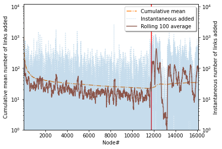
```

## How does the median ratio behave?
Query: <a href="https://en.wikipedia.org/wiki/Oakland_(Pittsburgh)">Oakland (Pittsburgh)</a> to <a href="https://en.wikipedia.org/wiki/Huangpu_District,_Shanghai">Huangpu District, Shanghai</a>

Notice the similarly shaped regions below?
```{r echo=FALSE, fig.align='center', out.width='50%'}
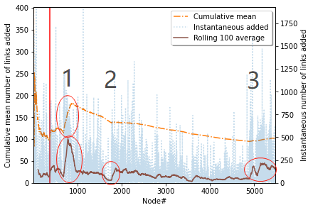
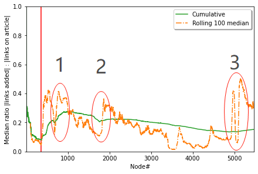
```

## Correlation
Note: Negative correlations are more likely to occur with only a few dozen articles
```{r echo=FALSE, fig.align='center', out.width='50%'}
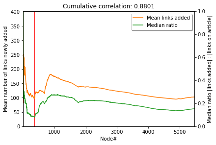
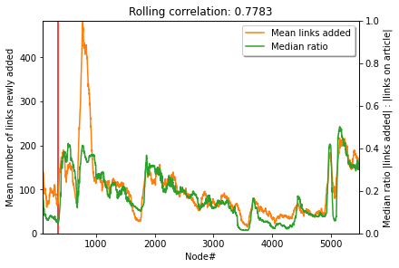
```

## Thank you
<a href ="https://github.com/FAE-Sonata/Wikipath">Link to repository</a>